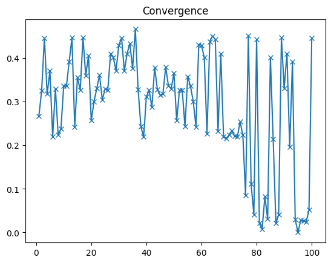

# ZACKS CLASSIFIER 

## NON-TECHNICAL EXPLANATION OF YOUR PROJECT
This project is a **failed** proof of concept of a classifier to replicate Zacks ranks from key financial metrics.

## DATA
Zacks.com provides stock rankings. Zacks ranks over 4400 companies based on changes to analyst earnings estimates. Check the guide for more information at https://advisortools.zacks.com/Content/ZAT_ZacksRankGuide.pdf.
There are a dozen key financial metrics to consider when evaluating a stock. These metrics are listed at https://yourfinancebook.com/stock-market-financial-metrics/ and can be obtained from Yahoo Finance.
These financial metrics are the features we hope can be used to label Zack ranks with a classifier.

`data.ipnyb` includes the code to collect the data.
`prepare.ipnyb` includes the code to clean and prep the data, including handling missing values and converting to z-score by industry.

The cleaned and prepped dataset `./data/data.csv` is imbalanced considering stocks witha Zack rank of 3 is overrepresented (approx 2000 of 2500 stocks).

## MODEL
Model selection has been completed with an under-sampled balanced dataset of approx. 5 classes * 110 records.

A Grid Search with K-Fold cross validation has been used to select the best classifier among:
- KNeighborsClassifier,
- ComplementNB,
- SVC,
- LogisticRegression,
- DecisionTreeClassifier,
- RandomForestClassifier,
- AdaBoostClassifier,
- QuadraticDiscriminantAnalysis,
- MLPClassifier.

DecisionTreeClassifier and MLPClassifier have performed best although quite poorly, with accuracy between 25% and 30%.

## HYPERPARAMETER OPTIMSATION
Hyperparamater optimisation has been completed with an over-sampled balanced dataset of approx. 5 classes * 1,500 records.

MLPClassifier has been retained and used for Bayesian optimisation **for the learning experience**, because it has more parameters to tune, including:
- activation,
- alpha,
- hidden_layer_sizes (2 hidden layers of 5 to 105 neurons),
- learning_rate,
- solver.

## RESULTS

With the under-sampled dataset, Bayesian optimisation converges with little progress on the accuracy score which remains stuck between 25% and 30% both for the training set and test set. There is not enough data to train the multilayer perceptron.

With the over-sampled dataset, Bayesian optimisation does not seem to converge but the accuracy score progresses from 37% to 65%. The best configuration is:
- activation: 'tanh',
- alpha: 0.31622776601683794,
- hidden_layer_sizes: (105, 86),
- learning_rate: 'invscaling',
- solver: 'lbfgs'

65% is not great. This proves there is not enough correlation between the features (key financial metrics) and the labels (Zacks ranks) to make a classifier that replicates Zacks rankings. Goind forward, other features might be needed, especially to reflect the progression in stock price time series and financial history (growth, dividends). Nevertheless this was a comprehensive and interesting learning experience, as it demonstrates the difficulty to select a relevant set of features to build a machine learning model.

